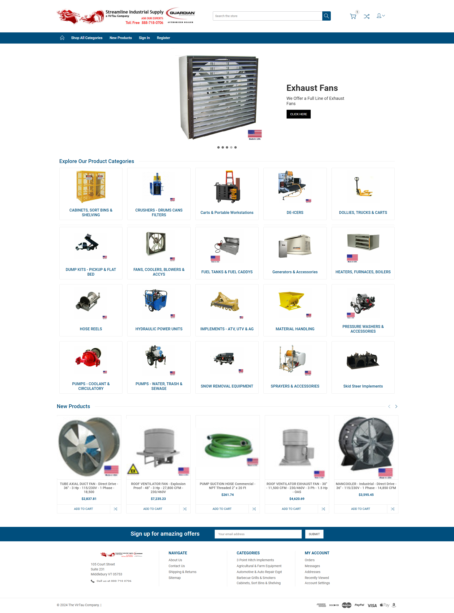

  <h1 align='center'>BIGCOMMERCE - streamlineindustrial.com</h1>

## INTRODUCTION

The website streamlineindustrial.com is an industrial e-commerce store specializing in equipment like pressure washers, sprayers, water, sewage, trash, and sludge pumps, along with HVAC systems. Built on the BigCommerce platform, the site leverages the Artify theme, enhanced through extensive customization. Key updates include tailored navigation and sidebar structures, along with adjustments to specific elements to meet unique client requirements.

These changes allow Streamline Industrial to stand out in both functionality and design, helping to create an intuitive, visually appealing experience that aligns with the brand’s industrial focus. The modifications ensure an optimized shopping journey, allowing users to easily locate products and gain quick access to essential categories. These personalized adjustments are achieved through a strategic approach to theme customization, combining seamless design with a focus on usability to suit the industrial, commercial, and residential needs of its target audience.

## FEEDBACK FROM CLIENT

I don't often use the word "wow", but what a difference! Yeah, that looks really good.

## TECHNOLOGIES USED

- <b>Platform</b>: BigCommerce

- <b>Theme</b>: Artify 1.5.1

## SCREENSHOT

  

